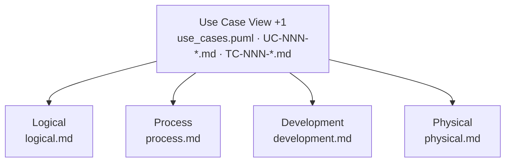

# Architecture

The architecture of AIUP PetClinic, written as the four views Philippe Kruchten
described in 1995 — plus the fifth that ties them together, but in reverse
order. Kruchten put the scenarios last, as a way to validate the other four
views. Here they come first: a use case is the unit of work, and the other four
views describe how a use case turns into code.

These documents are **context for an AI coding agent**, not a wiki page. That
sets three rules for them:

- **Text, not pictures.** Diagrams are Mermaid or PlantUML so an agent can read
  and change them. A PNG it can only ignore.
- **In the repository, not beside it.** Architecture and code are versioned
  together and change in the same pull request.
- **Short, not complete.** What is not written here gets invented; what is
  written at length gets skimmed.

## The five views



| View              | Question it answers                      | Where it lives                                                                                               |
|-------------------|------------------------------------------|--------------------------------------------------------------------------------------------------------------|
| **Use Case (+1)** | What should the system do, and for whom? | [`../use_cases.puml`](../use_cases.puml), [`../use_cases/`](../use_cases), [`../test_cases/`](../test_cases) |
| **Logical**       | Which business building blocks exist?    | [`logical.md`](logical.md) (+ [`../entity_model.md`](../entity_model.md))                                    |
| **Process**       | How does the system behave at runtime?   | [`process.md`](process.md)                                                                                   |
| **Development**   | How is the code organized?               | [`development.md`](development.md) + [`testing.md`](testing.md)                                              |
| **Physical**      | Where does the system run?               | [`physical.md`](physical.md)                                                                                 |

The Use Case View deliberately sits outside `architecture/`. It is the base the
architecture is built on, not a part of it.

## What an agent reads, and when

| Task                                         | Read first                                                             |
|----------------------------------------------|------------------------------------------------------------------------|
| Implement or change a use case               | its `UC-NNN-*.md`, then [`development.md`](development.md)             |
| Add an entity, attribute, or domain rule     | [`logical.md`](logical.md), [`../entity_model.md`](../entity_model.md) |
| Touch a save, a transaction, or a lookup     | [`process.md`](process.md)                                             |
| Change the build, the stack, or a convention | [`development.md`](development.md)                                     |
| Write or change a test                       | [`testing.md`](testing.md)                                             |
| Change how or where the app is run           | [`physical.md`](physical.md)                                           |
| Make a decision that contradicts a view      | [`adr/`](adr) — the same question has probably been answered once      |

`CLAUDE.md` in the repository root is the short form of all of this: the
entry point that says which document to open for which task.

## One home per fact

Every rule is stated **once**, in the view it belongs to. The code conventions
are not a separate guidelines folder any more — they *are* the Development View,
together with [`testing.md`](testing.md) for the test conventions. `CLAUDE.md`
is the index, not a second copy: it says which document to open, and holds only
what an agent needs in every single turn.

When a document would have to repeat something another one already says, it
links instead. Two documents stating the same rule are one edit away from
contradicting each other, and nobody can tell which one is the lie.

**No business logic lives in this folder.** A rule about owners, pets, or visits
belongs to the use case that needs it, or to
[`../business_rules.md`](../business_rules.md) when several use cases share it.
These documents say *where* a rule of a given kind is honoured — that is an
architectural decision and stays true however the rules change.

The views are also **prescriptive, not descriptive**: they say how a use case is
to be built, not what the code that exists happens to do. That is what lets the
same documents guide the first use case and the tenth — and why they name
patterns and use case ids rather than the classes of whichever use cases are
already implemented.

## Architecture Decision Records

The views describe the state. The ADRs describe why it is that state. An agent
facing the same question again reads them and decides the way the team decided,
instead of deciding anew.

ADR-001 to ADR-008 were written after the fact, reconstructing decisions the code
already embodies — like [`../vision.md`](../vision.md). From here on, a decision
that could have gone the other way gets its ADR when it is made.

| ADR                                                              | Decision                                                      |
|------------------------------------------------------------------|---------------------------------------------------------------|
| [ADR-001](adr/ADR-001-jooq-instead-of-jpa.md)                    | jOOQ with generated SQL instead of JPA/Hibernate              |
| [ADR-002](adr/ADR-002-vaadin-flow-server-side-ui.md)             | Vaadin Flow server-side UI instead of REST plus an SPA        |
| [ADR-003](adr/ADR-003-flyway-owns-the-schema.md)                 | Flyway owns the schema; jOOQ code generation runs against it  |
| [ADR-004](adr/ADR-004-package-by-feature-ui-domain.md)           | Package by feature with `ui` + `domain`, no service layer     |
| [ADR-005](adr/ADR-005-validation-in-the-form.md)                 | Validation lives in the Vaadin form, not in the domain record |
| [ADR-006](adr/ADR-006-two-test-layers-merged-coverage.md)        | Two test layers — browserless `*Test` and Playwright `*IT`    |
| [ADR-007](adr/ADR-007-traceability-sensors.md)                   | Specification traceability enforced by tests, not by review   |
| [ADR-008](adr/ADR-008-no-authentication.md)                      | No authentication; a trusted clinic network is assumed        |
| [ADR-009](adr/ADR-009-repository-is-the-transaction-boundary.md) | The repository is the transaction boundary                    |

## Traceability

```
Requirement → Use Case → View → Code → Test
```

Worked example, end to end:

`FR-015 Distinguishable Pet Names` → [`GR-006`](../business_rules.md#gr-006-unique-pet-name-per-owner)
→ `UC-007 BR-001` → Logical View (*a rule needing a lookup is honoured in the
view; one the data must never break is a constraint*) and Process View (*the two
are separate transactions, so the constraint is the backstop*) → the `pet`
module's form, queries, and migration → a test method annotated
`@UseCase(id = "UC-007", businessRules = "BR-001", scenario = "A1: Duplicate Pet Name for Owner")`.

The last two arrows are enforced: `UseCaseTraceabilityTest` and
`TestCaseTraceabilityTest` fail the build when an annotation points at a use
case, flow, or business rule that does not exist.
