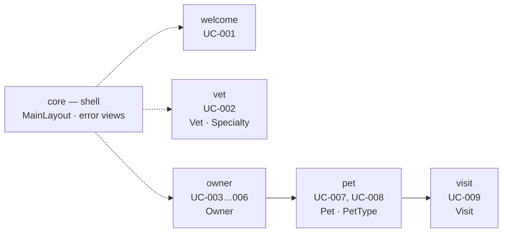

# Logical View

**Question:** Which business building blocks does the system consist of?  
**Artifacts:** this document, [`../entity_model.md`](../entity_model.md)  
**Notation:** Mermaid for diagrams, Markdown tables for attributes and rules  
**For the agent:** where new code belongs, which entities already exist, and
which rules hold for an attribute. The entity model is the schema: do not invent
a table when one already fits.

## Feature modules

Five business modules plus one technical shell. A module owns its entities, its
queries, and the views of the use cases it serves.

| Module    | Entities owned                      | Use cases       |
|-----------|-------------------------------------|-----------------|
| `welcome` | —                                   | UC-001          |
| `vet`     | `VET`, `SPECIALTY`, `VET_SPECIALTY` | UC-002          |
| `owner`   | `OWNER`                             | UC-003 … UC-006 |
| `pet`     | `PET`, `PET_TYPE`                   | UC-007, UC-008  |
| `visit`   | `VISIT`                             | UC-009          |
| `core`    | — (app shell and error views)       | UC-010          |

What a module contains follows from the use cases assigned to it and the naming
rules of the Development View: one view per use case, one `<Entity>` record and
one `<Entity>Repository` per entity, a shared `<Entity>Form` where several use
cases edit the same entity.

The clinic is small enough that these are modules, not bounded contexts: there
is one ubiquitous language and one database schema. `Owner` means the same thing
everywhere.

## Boundaries

- A module reaches into another module through its **`domain`** package only —
  never through its `ui`.
- The one exception is routing: the shell and the aggregating views (e.g.
  the owner details screen of UC-005 linking to the add-pet screen of UC-007)
  may name another module's view class as a **route token** and build its
  parameters through that module's `*RouteParameters` holder. No instantiation
  of views, no other calls, no state.
- Because of that exception the module graph above is cyclic by design (`owner` → `visit` → `pet` → `owner`). The
  `domain` packages are not, and must
  stay that way — `ArchitectureTest.noCyclesBetweenFeatures` slices on
  `(*).domain..` for exactly that reason.

The enforced form of these rules is in
[`development.md`](development.md#cross-feature-rule--and-its-one-exception).

## Where a business rule goes

A business rule is **not** architecture and is not stated here. It is stated in
the use case that needs it, or — when several use cases need it — once in
[`../business_rules.md`](../business_rules.md) as a `GR-NNN` rule the use cases
reference.

What this view says about rules is only *where* they are honoured, which is an
architectural decision and holds whatever the rules turn out to be:

| Kind of rule                          | Honoured in                                                     |
|---------------------------------------|-----------------------------------------------------------------|
| Field-level input rule                | the feature's `<Entity>Form` — the validation boundary ([ADR-005](adr/ADR-005-validation-in-the-form.md)) |
| A rule that needs a database lookup   | the view, between validation and the write; see [`process.md`](process.md#concurrency) |
| A rule the data itself must never break | a constraint in the Flyway migration, so it holds no matter which code writes |
| Ordering of a list                    | an `ORDER BY` in the query that feeds it — never a sort in the view |
| Reachability of a route               | the view's `beforeEnter`, which throws `NotFoundException` when the entity does not fit the route |

**Validation is not in the domain records.** Domain types are plain records with
no annotations and no constructor checks — the form is the validation boundary.

## Reference data

`VET`, `SPECIALTY`, `VET_SPECIALTY` and `PET_TYPE` are reference data: the
practice maintains them directly in the database and the application only reads
them (C-011). That is a modelling fact with a structural consequence — those
modules need read queries and no write path. An agent asked for a "manage
specialties" screen is being asked for something outside the current scope.
