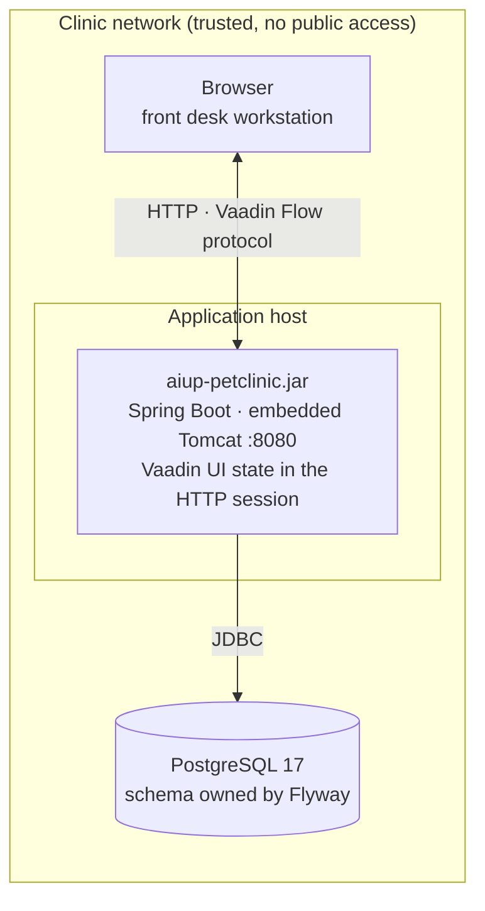

# Physical View

**Question:** Where does the system run?  
**Artifacts:** this document (deployment diagram, environments, constraints)  
**Notation:** Mermaid deployment diagram, Markdown  
**For the agent:** the boundary conditions. An agent that knows the database is
PostgreSQL, that the session state lives in the server, and that the app runs on
a trusted network inside the clinic decides differently from one that does not.

## Deployment

Two nodes, one process each. No reverse proxy, no cache, no message broker, no
second service — the Logical and Process views have nothing that would need one.

## Environments

| Environment      | How it starts                                                            | Database                                                                   | Notes                                                                                                           |
|------------------|--------------------------------------------------------------------------|----------------------------------------------------------------------------|-----------------------------------------------------------------------------------------------------------------|
| **Local dev**    | `./mvnw spring-boot:test-run` (`TestAiupPetclinicApplication`)           | `postgres:17-alpine` started by Testcontainers                             | Needs Docker. Opens the browser (`vaadin.launch-browser=true`), Spring DevTools and Vaadin dev tools are active |
| **Build / test** | `./mvnw test` · `./mvnw verify`                                          | Testcontainers, one container per run; jOOQ code generation starts its own | Needs Docker (C-007)                                                                                            |
| **CI**           | GitHub Actions, `ubuntu-latest`, JDK 25, `mvn -B verify` + Sonar scanner | Testcontainers on the runner                                               | `.github/workflows/build.yml`; caches `~/.m2` and the Playwright browsers                                       |
| **Production**   | `java -jar aiup-petclinic.jar` (fat JAR from `./mvnw package`)           | an external PostgreSQL 17, credentials from the environment                | Target state — **nothing is deployed today**; see *Not there yet*                                               |

Flyway runs at startup and brings the schema to the current version. The
test-only `V2__seed_reference_data.sql` lives on the test classpath and never
reaches a production database.

## Runtime constraints

- **Server-side UI state means sticky sessions.** Vaadin holds the component
  tree of every open UI in the HTTP session. One instance is assumed. Two
  instances behind a load balancer require session affinity — session
  replication is not configured, and a session lost on failover means the user's
  open form is gone. Scale vertically first; a second instance is an
  architecture change, not a configuration change.
- **One database, no read replicas.** Every query goes to the primary.
- **PostgreSQL only** (C-005). The migrations use PostgreSQL sequences and the
  code is generated from a PostgreSQL schema — the SQL is not portable, and it
  is not meant to be.
- **Port 8080** by default. Spring Boot Actuator is on the classpath; only its
  default endpoints are available and nothing has been exposed or secured
  deliberately. If this is ever put on a network with anything else on it, that
  is the first thing to configure.

## Security and data

- **No authentication, no authorization** (C-010). Whoever reaches the
  application can do everything a Clinic User can, including reading and
  changing customer data. This is deliberate for the demo and is the single
  precondition of the whole deployment: **the application may not be exposed
  beyond the clinic's own network.** Adding authentication is the first change a
  real deployment needs, and it changes the Use Case View too (the Visitor /
  Clinic User split becomes enforced instead of implied).
- **TLS is not terminated by the application.** If it is needed, it belongs in
  front of the app.
- **Owner records are personal data** — name, address, telephone. No backup
  schedule, retention period, or hosting location is specified anywhere in
  `docs/`, and none can be invented here. For a real clinic these have to be
  supplied before deployment.

## Not there yet

Honest list of what a production deployment would add. None of it exists in the
repository today, so an agent should not pretend to change it:

- no container image (`./mvnw spring-boot:build-image` would produce one),
- no infrastructure as code, no deployment pipeline beyond the CI build,
- no externalized production configuration (`spring.datasource.*` is supplied by
  Testcontainers in every environment that exists today),
- no monitoring, log aggregation, or alerting,
- no backup or restore procedure,
- no availability target, and no measured response-time budget to hold the
  "keeps up with a conversation" goal from the vision to.
