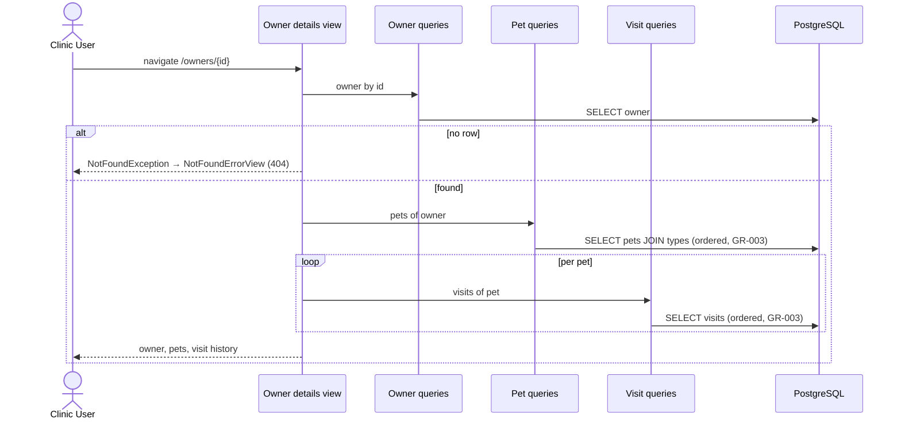
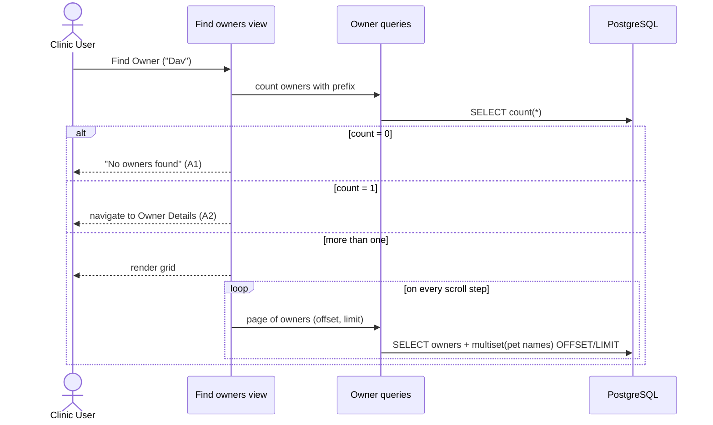
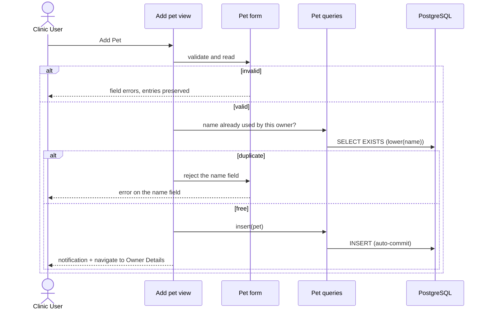

# Process View

**Question:** How does the system behave at runtime?  
**Artifacts:** this document (sequence diagrams, transaction boundaries,
concurrency rules)  
**Notation:** Mermaid sequence diagrams, Markdown for rules  
**For the agent:** where a transaction begins and ends, what runs in the
background (nothing, today), and which races are accepted. Without this view an
agent quietly builds everything into one synchronous request — which happens to
be right here, but for reasons worth knowing.

## Runtime shape

One process. The UI is server-side: a browser event travels over the Vaadin
Flow protocol into the JVM, a view method runs, jOOQ statements go to
PostgreSQL, and the resulting UI change travels back. There is no REST layer,
no client-side state to keep in sync, and no second runtime.

- **One view instance per navigation.** Route targets are Spring beans created
  per navigation; their state (the loaded owner, the form contents) lives in the
  user's session with the Vaadin `UI` until the user navigates away.
- **Repositories are singletons and stateless.** They hold a `DSLContext` and
  nothing else, so nothing about a user survives in them.
- **A user interaction is single-threaded.** Vaadin holds the session lock for
  the duration of the event, so two events of the same user never overlap.

## Reading a screen — UC-005 View Owner Details

The per-pet loop is an accepted `1 + 1 + n` — `n` is the number of pets of one
owner, which is small and bounded. The lists that are *not* bounded never do
this; see *Query cost* below.

## Searching — UC-004 Find Owners by Last Name

## Writing — UC-007 Add Pet to Owner

Every write in the application follows this shape: **validate in the form →
check what the database alone cannot check → one statement → confirm →
navigate.** The confirmation is not decoration; FR-022 requires it.

## Transaction boundaries

**The repository is the transaction boundary.** Every repository is annotated
`@Transactional(readOnly = true)` at class level; `insert` and `update` override
it with a plain `@Transactional`. A view never opens a transaction — a view
method spans a user interaction, and a transaction that waits for a user is held
far too long. `ArchitectureTest.repositoriesAreTransactional` and `viewsAreNotTransactional`
keep it that way.

What that means per use case today:

- **Every use case writes exactly one row with one statement.** Register owner,
  update owner, add pet, update pet, book visit — one `INSERT` or `UPDATE` each,
  in one transaction of its own.
- **The reads of one screen are separate transactions.** The owner details
  screen (UC-005) loads the owner, the pets, and each pet's visits in several
  read-only transactions, not one. Consistent per read, not across the screen — acceptable
  for a front desk reading one owner, and the alternative would mean holding a
  transaction across the rendering of a view.
- **A transaction never spans a user interaction.** The duplicate-name check and
  the insert that follows it are two transactions, deliberately; see below.

**The rule for the next use case:** the moment a use case needs *two* statements
to succeed or fail together, write **one** `@Transactional` method in the
owning module's `domain` package that performs both, and add a line here saying
which use case made it necessary. Two calls from a view are two transactions, no
matter what the view does between them.

## Concurrency

- **A rule that needs a lookup before the write is a check-then-act.** The one
  that has it today is
  [GR-006](../business_rules.md#gr-006-unique-pet-name-per-owner) (UC-007 /
  UC-008 BR-001): the lookup and the `INSERT` are two transactions with a user's
  click between them, so two clerks writing the same value for the same owner at
  the same moment can both pass the check. The database is the backstop —
  `pets_owner_name_unique` is a unique index on `(owner_id, lower(name))`, which
  compares the way the rule says it must, so the loser of the race gets a
  `DataIntegrityViolationException`, translated by the `@Repository` stereotype
  and rendered by `ApplicationErrorView`. The check in the view exists to turn
  the common case into a field-level error instead of an error page.

  **The shape generalizes:** a rule the database cannot express alone is checked
  before the write, and where the data must never break it, a constraint that
  compares the same way is the backstop. Never the check alone.

- **Updates are last-write-wins.** No version column, no optimistic locking. Two
  clerks editing one record: the later save silently wins. No use case asks for
  more, and adding it would change the use cases that update — so it is a
  specification change first and a code change second.

- **No pessimistic locks, no `SELECT … FOR UPDATE`.**

## Synchronous and asynchronous processing

Everything is synchronous, inside the user's request:

| Mechanism                      | Used? |
|--------------------------------|-------|
| Batch jobs / schedulers        | no    |
| Message queues / domain events | no    |
| `@Async`, background threads   | no    |
| Vaadin `@Push` / server push   | no    |
| Caching layer                  | no    |

An agent must not introduce any of them to solve a problem the specification
does not pose. If a use case ever needs one, it changes this table and gets an
ADR.

## Query cost

- **Unbounded lists load lazily** ([GR-002](../business_rules.md#gr-002-lazy-loading-of-lists),
  NFR-001/002): `findPage(offset, limit)` plus
  a paired `count()`, wired as a Vaadin callback data provider. Rows fetched per
  scroll step do not grow with the table size.
- **To-many data in a lazy grid is pre-joined with `multiset(...)`** so a grid
  never issues a query per row — the owner search results with their pet names
  (UC-004) and the vet directory with its specialties (UC-002).
- **Indexes carrying this:** `owners_last_name_idx` (prefix search),
  `pets_owner_name_unique` (leads with `owner_id`, so it serves the lookups by
  owner as well as the uniqueness check), `visits_pet_id_idx`.

## Failure paths

| At runtime                                  | Result                                                  |
|---------------------------------------------|---------------------------------------------------------|
| Entity missing in `beforeEnter`             | `NotFoundException` → `NotFoundErrorView`, HTTP 404      |
| Anything else thrown                        | `ApplicationErrorView`, HTTP 500                         |
| `SQLException` from jOOQ                    | translated to Spring's `DataAccessException` by the `@Repository` stereotype, then handled as above |

Both error views render **inside `MainLayout`**, so the drawer and header stay
usable (NFR-005), and both show the message only — never a stack trace
(NFR-004, UC-010 BR-003). `/oups` (`CrashView`) exists to demonstrate this path
on purpose (UC-010 BR-004).
