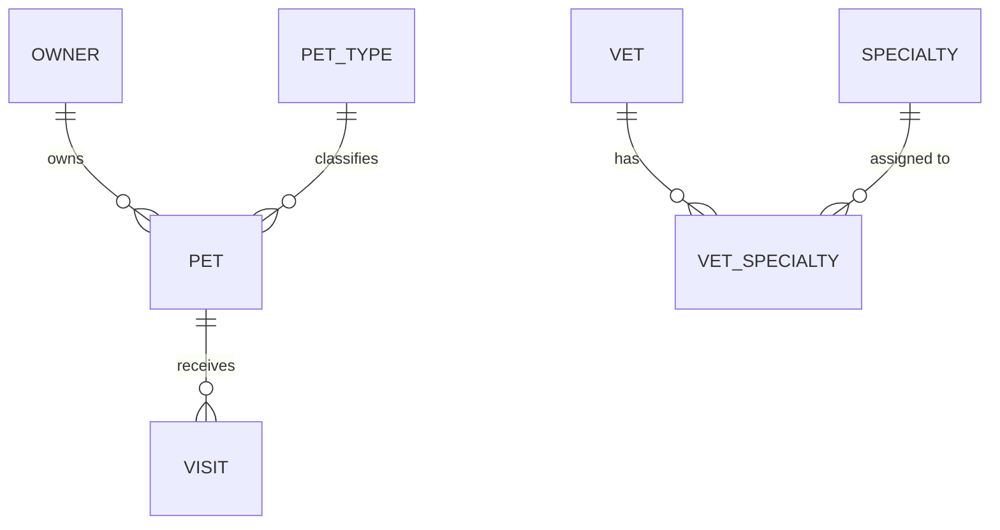

# Entity Model

## Entity Relationship Diagram

### OWNER

Represents a pet owner who is registered with the clinic and can bring pets in for visits.

| Attribute  | Description                        | Data Type | Length/Precision | Validation Rules              |
|------------|------------------------------------|-----------|------------------|-------------------------------|
| id         | Unique identifier                  | Integer   | 10               | Primary Key, Sequence         |
| first_name | Owner's first name                 | String    | 30               | Not Null                      |
| last_name  | Owner's last name                  | String    | 30               | Not Null                      |
| address    | Street address of the owner        | String    | 255              | Not Null                      |
| city       | City of residence                  | String    | 80               | Not Null                      |
| telephone  | Contact phone number (10 digits)   | String    | 20               | Not Null, Format: \d{10}      |

### PET

Represents an animal belonging to an owner that can be the subject of veterinary visits.

| Attribute  | Description                         | Data Type | Length/Precision | Validation Rules                |
|------------|-------------------------------------|-----------|------------------|---------------------------------|
| id         | Unique identifier                   | Integer   | 10               | Primary Key, Sequence           |
| name       | Name of the pet                     | String    | 30               | Not Null                        |
| birth_date | Date of birth of the pet            | Date      | -                | Optional                        |
| type_id    | Reference to the pet type (species) | Integer   | 10               | Not Null, Foreign Key (TYPES.id)|
| owner_id   | Reference to the owning owner       | Integer   | 10               | Not Null, Foreign Key (OWNERS.id)|

**Constraints:** A pet's name must be unique within the scope of its owner. Birth date must not be in the future.

### PET_TYPE

Defines the species or category of a pet (e.g., Cat, Dog, Hamster, Lizard, Snake, Bird).

| Attribute | Description                  | Data Type | Length/Precision | Validation Rules       |
|-----------|------------------------------|-----------|------------------|------------------------|
| id        | Unique identifier            | Integer   | 10               | Primary Key, Sequence  |
| name      | Display name of the pet type | String    | 80               | Not Null, Unique       |

### VISIT

Represents a veterinary visit booked for a specific pet, documenting the reason for the appointment.

| Attribute   | Description                          | Data Type | Length/Precision | Validation Rules                |
|-------------|--------------------------------------|-----------|------------------|---------------------------------|
| id          | Unique identifier                    | Integer   | 10               | Primary Key, Sequence           |
| visit_date  | Date of the visit (defaults to today)| Date      | -                | Not Null                        |
| description | Description of the visit purpose     | String    | 255              | Not Null                        |
| pet_id      | Reference to the pet being visited   | Integer   | 10               | Not Null, Foreign Key (PETS.id) |

### VET

Represents a veterinarian employed by the clinic who may hold one or more specialties.

| Attribute  | Description         | Data Type | Length/Precision | Validation Rules      |
|------------|---------------------|-----------|------------------|-----------------------|
| id         | Unique identifier   | Integer   | 10               | Primary Key, Sequence |
| first_name | Vet's first name    | String    | 30               | Not Null              |
| last_name  | Vet's last name     | String    | 30               | Not Null              |

### SPECIALTY

Defines a veterinary specialty (e.g., radiology, surgery, dentistry) that can be assigned to vets.

| Attribute | Description                | Data Type | Length/Precision | Validation Rules      |
|-----------|----------------------------|-----------|------------------|-----------------------|
| id        | Unique identifier          | Integer   | 10               | Primary Key, Sequence |
| name      | Display name of specialty  | String    | 80               | Not Null, Unique      |

### VET_SPECIALTY

Join entity that associates veterinarians with the specialties they hold (many-to-many).

| Attribute    | Description                     | Data Type | Length/Precision | Validation Rules                      |
|--------------|---------------------------------|-----------|------------------|---------------------------------------|
| vet_id       | Reference to the veterinarian   | Integer   | 10               | Not Null, Foreign Key (VETS.id)       |
| specialty_id | Reference to the specialty held | Integer   | 10               | Not Null, Foreign Key (SPECIALTIES.id)|

**Constraints:** The combination of vet_id and specialty_id is unique (composite primary key).
